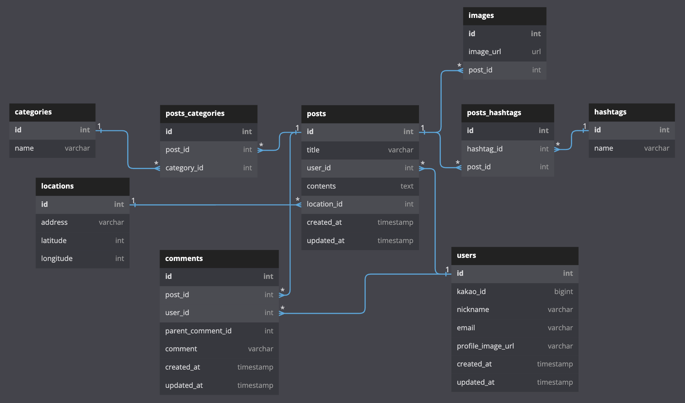

# 프로젝트 소개

* 프로젝트명: Fresh us
* 개발기간: 2022.08.01-2022.08.11
* 개발인원: Frontend 4, Backend 2 (Backend 담당)
* 기술스택: Python, Django, MySQL, Miniconda

친환경을 주제로한 여행지 커뮤니티 사이트를 구현해보았습니다. 짧게 정해진 프로젝트 기한에 맞추기 위해 기존의 커머스 사이트 싱그러운 집(https://www.shouse.garden/main/main.html)사이트의 기획을 클론하였습니다. 짧은 기간안에 결과물을 만들기 위해 웹 서비스 작성시 대부분의 기반이 이미 만들어져있는 장고 프레임워크를 사용하였습니다. 

## 구현

* 소셜 API를 이용한 회원가입 및 로그인
* 게시물 목록 조회, 검색 및 페이지네이션 구현
* 게시물 CRUD 구현
* 댓글 CRUD 구현
 
### 데이터베이스 다이어그램

### 프로젝트 구현 상세 (Backend)

* 카카오 소셜 API를 이용하여 회원가입 및 로그임 구현

    카카오 API를 사용하여 클라이언트의 카카오 회원 정보를 이용해 자체 사이트 회원가입을 하는 방식을 채택했습니다. 클라이언트에서 카카오 인증 과정을 거쳐 인가 코드를 받아와 서버 측에 전달하면 해당 인가 코드를 이용하여 토큰을 얻어오고 클라이언트의 카카오 회원 정보를 가져옵니다. 일련의 과정들이 완료되면 카카오 토큰은 만료시킵니다.

    회원가입이 된 이후 클라이언트의 인증 상태를 유지하기 위해 토큰 기반 인증 방식을 채택하였습니다. payload에 담긴 유저의 정보를 가지고 인가 과정을 거치게 됩니다.

* 게시물 리스트 및 CRUD 구현

    게시물 리스트 페이지에서는 무작위로 추천 게시물이 3개씩 표현됩니다. 그리고 게시물은 위도, 경도의 정보를 포함하고 있어 추천 게시물의 위치 데이터를 기반으로 지도에 위치를 표시합니다.
    
    게시물을 등록할 때 제목, 본문 등의 정보는 모두 자체 서버 데이터베이스에 저장되게 됩니다. 이미지 파일의 경우 AWS의 s3를 이용하였습니다. 

* 댓글 CRUD 구현

    기본적으로 게시물에 작성되는 댓글의 CRUD를 구현하였습니다. 특징적인 부분은 댓글과 하위 댓글입니다. 클라이언트는 댓글의 대댓글을 작성할 수 있습니다. 댓글과 대댓글은 기본적으로 최신순으로 상위에 노출됩니다. 댓글과 대댓글의 개수를 합쳐 한 페이지에 5개의 댓글이 노출되도록 구현하였습니다. 댓글과 대댓글은 depth로 구분합니다.

## API 명세서

* [싱그러운 우리 API](https://pastoral-slice-3c4.notion.site/API-553343a65d5c49c1bdf2024745ce39c9)를 보시면, 자세한 API를 확인 가능합니다.

## 참고
- 이 프로젝트는 [싱그러운 집](https://www.shouse.garden/main/main.html) 사이트를 참조하여 학습 목적으로 만들었습니다.
- 실무수준의 프로젝트이지만 학습용으로 만들었기 때문에 이 코드를 활용하여 이득을 취하거나 무단 배포할 경우 법적으로 문제될 수 있습니다.
